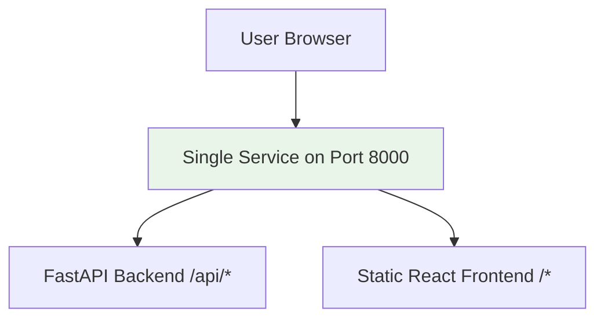
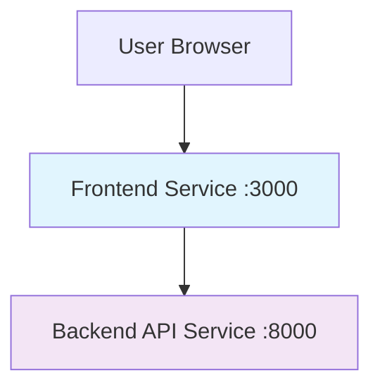

# Deployment Options for Active Learning NER

This project can be deployed in **two different ways** depending on your needs:

## 🚀 Option 1: Unified Single Service (Recommended)

### **What it is:**
- Single deployment that serves both frontend and backend
- Frontend is built and served as static files from the FastAPI backend
- Only one URL needed
- Simpler deployment and management

### **How it works:**


### **Files for Unified Deployment:**
- `render-unified.yaml` - Single service configuration
- `api/main_unified.py` - Backend that also serves frontend
- `frontend/src/services/api_unified.js` - API client with /api prefix
- `Dockerfile.unified` - Single container build
- `docker-compose-unified.yml` - Local unified development

### **Render Deployment (Unified):**
```bash
# Use the unified render configuration
cp render-unified.yaml render.yaml

# The frontend will be built and served from the backend
# Access everything at: https://your-app.onrender.com
```

### **Advantages:**
✅ **Simpler deployment** - Only one service to manage  
✅ **Lower cost** - Uses only one Render service  
✅ **No CORS issues** - Everything served from same origin  
✅ **Single URL** - One domain for everything  
✅ **Easier SSL** - Only one certificate needed  

### **Disadvantages:**
❌ **Slower builds** - Has to build both frontend and backend  
❌ **Larger container** - Includes both Node.js and Python  
❌ **Less scalable** - Can't scale frontend and backend independently  

---

## 🔧 Option 2: Separate Services

### **What it is:**
- Two separate deployments: one for frontend, one for backend
- Frontend and backend can be scaled independently
- More traditional microservices approach

### **How it works:**


### **Files for Separate Deployment:**
- `render.yaml` - Two service configuration
- `api/main.py` - Backend-only service
- `frontend/src/services/api.js` - API client with full URL
- `api/Dockerfile` + `frontend/Dockerfile` - Separate containers
- `docker-compose.yml` - Local development with two services

### **Render Deployment (Separate):**
```bash
# Use the original render configuration
# This creates two services:
# - Frontend at: https://your-frontend.onrender.com
# - Backend at: https://your-backend.onrender.com
```

### **Advantages:**
✅ **Independent scaling** - Scale frontend and backend separately  
✅ **Faster individual builds** - Only rebuild what changed  
✅ **Technology flexibility** - Use different hosting for each  
✅ **Better for large teams** - Separate deployment pipelines  

### **Disadvantages:**
❌ **More complex** - Two services to manage  
❌ **Higher cost** - Uses two Render services  
❌ **CORS configuration** - Need to handle cross-origin requests  
❌ **Two URLs** - Need to manage multiple domains  

---

## 📋 Quick Comparison

| Feature | Unified Service | Separate Services |
|---------|----------------|-------------------|
| **Cost** | 💰 Lower (1 service) | 💰💰 Higher (2 services) |
| **Complexity** | 🟢 Simple | 🟡 Moderate |
| **Build Time** | 🔴 Slower | 🟢 Faster |
| **Scalability** | 🟡 Limited | 🟢 Flexible |
| **CORS Issues** | 🟢 None | 🟡 Requires config |
| **SSL/Domains** | 🟢 Single | 🟡 Multiple |

---

## 🎯 Recommended Approach

### **For Development & Small Projects:**
**Use Unified Deployment** - It's simpler and cheaper

### **For Production & Large Scale:**
**Use Separate Services** - Better scalability and flexibility

---

## 🚀 How to Switch Between Options

### **Switch to Unified (from current setup):**
```bash
# 1. Copy unified files
cp render-unified.yaml render.yaml
cp api/main_unified.py api/main.py
cp frontend/src/services/api_unified.js frontend/src/services/api.js

# 2. Update package.json to use /api prefix
# 3. Deploy single service
```

### **Switch to Separate (from unified):**
```bash
# 1. Restore original files
git checkout api/main.py
git checkout frontend/src/services/api.js
git checkout render.yaml

# 2. Deploy two services
```

---

## 🛠️ Local Development for Both Options

### **Unified Development:**
```bash
# Build and run unified container
docker-compose -f docker-compose-unified.yml up --build

# Access at: http://localhost:8000
```

### **Separate Development:**
```bash
# Run separate services
docker-compose up --build

# Frontend: http://localhost:3000
# Backend: http://localhost:8000
```

Or with npm:
```bash
# Terminal 1: Backend
cd api && uvicorn main:app --reload

# Terminal 2: Frontend  
cd frontend && npm start

# Or use the npm script:
npm run dev  # Runs both concurrently
```

---

## 🎉 Recommendation

**Start with Unified Deployment** for simplicity, then migrate to Separate Services if you need more scalability or have a larger team.

The unified approach is perfect for:
- MVPs and prototypes
- Small to medium applications
- Cost-conscious deployments
- Single developer or small team projects

The separate approach is better for:
- Large-scale production applications
- Teams with separate frontend/backend developers
- Applications requiring independent scaling
- Complex deployment pipelines