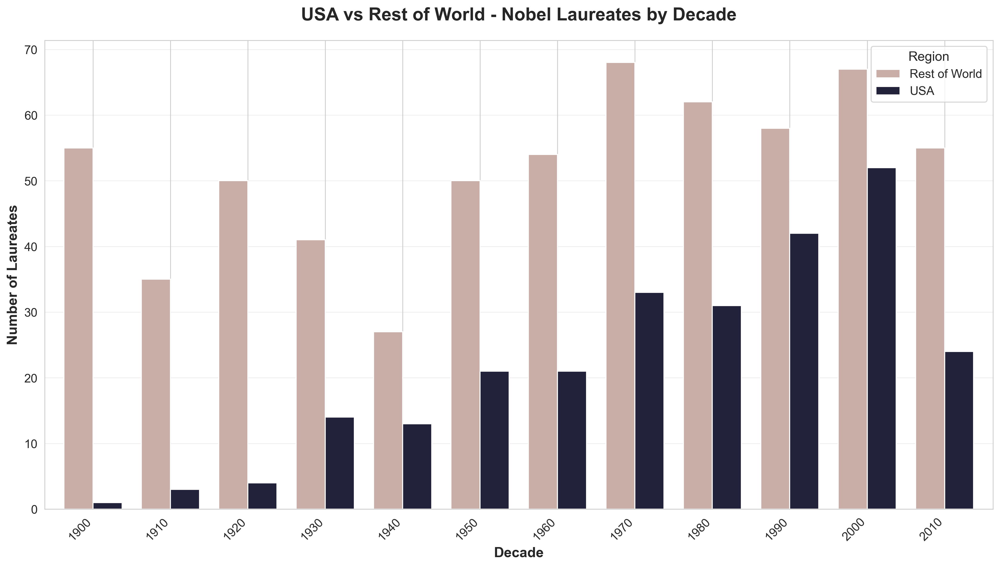
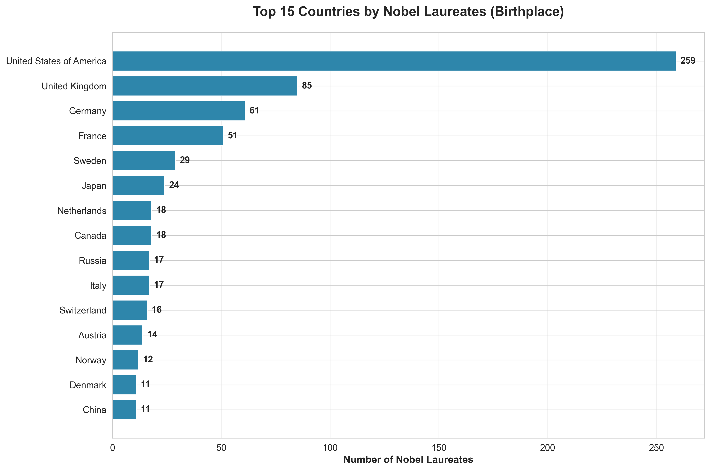
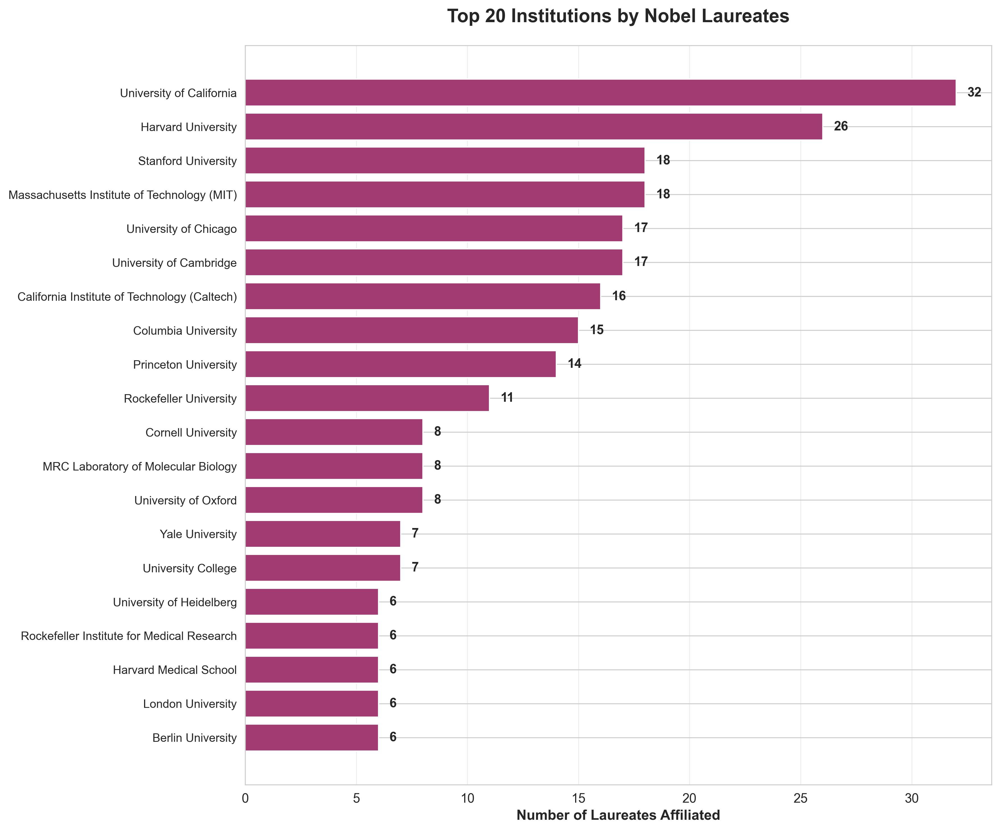
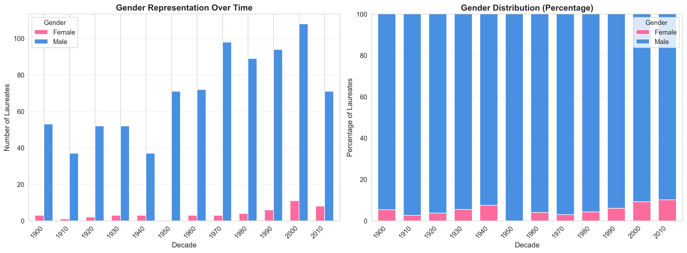
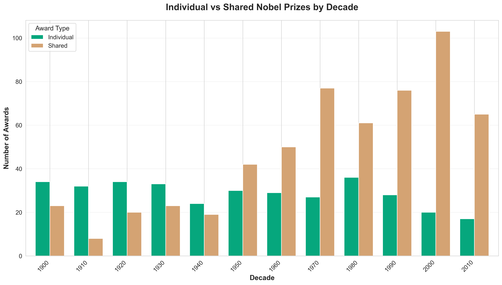
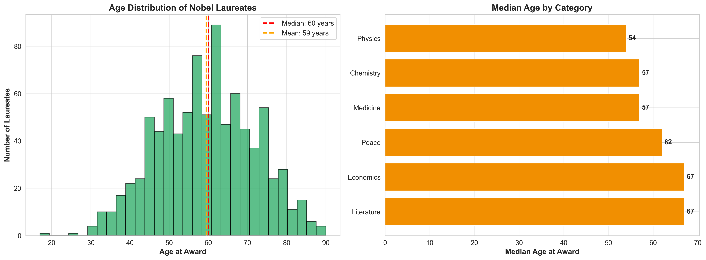
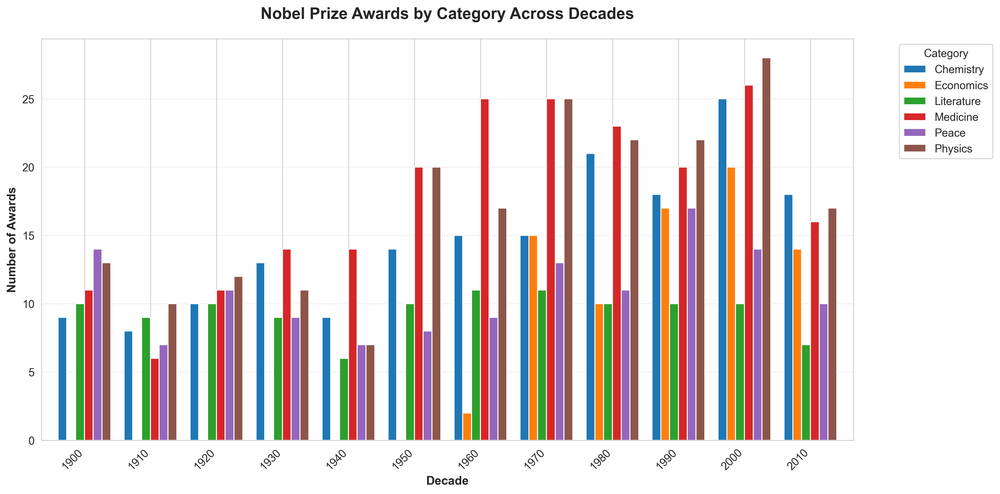
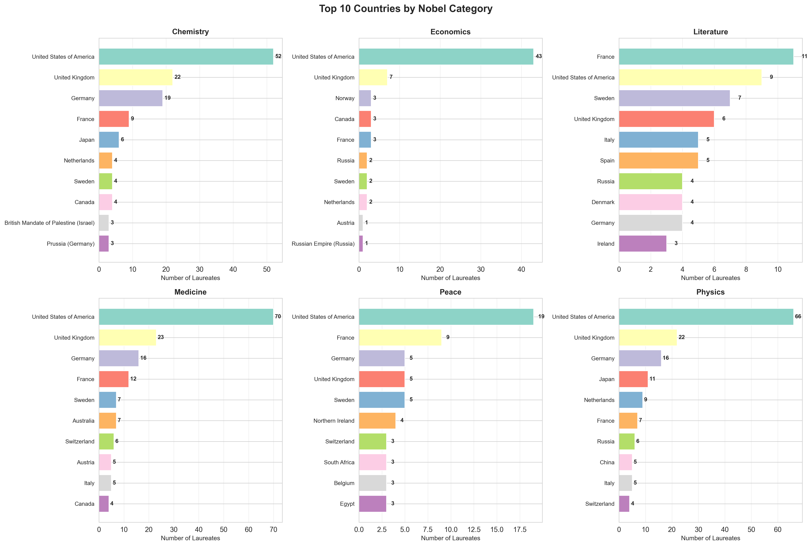
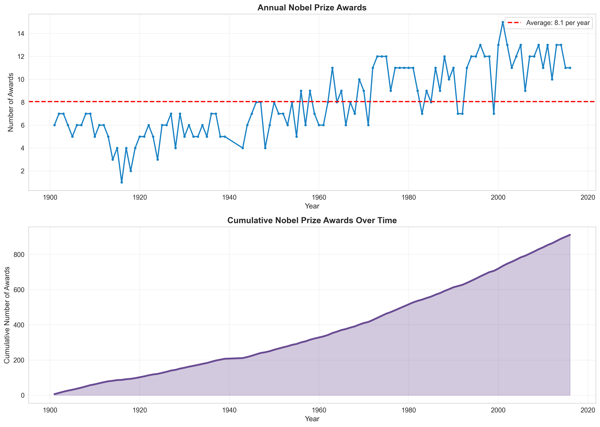
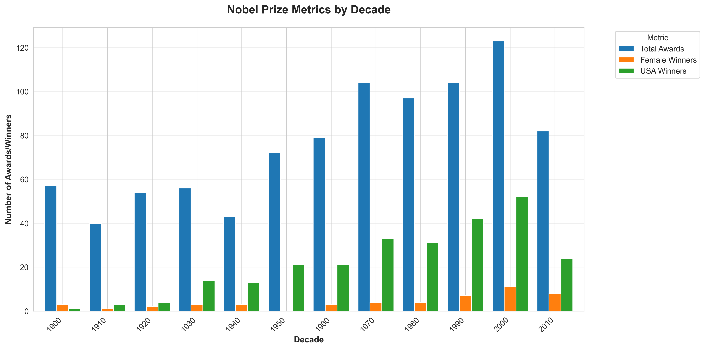

# Nobel Prize Analysis: Strategic Insights and Trends
## Executive Summary Report

---

## Overview

This analysis examines **911 Nobel Prize awards** spanning from **1901 to 2016**, covering six major categories: Physics, Chemistry, Medicine, Literature, Peace, and Economics. The insights presented here reveal critical patterns in global talent distribution, institutional performance, diversity trends, and collaboration dynamics that can inform strategic decision-making in research investment, talent acquisition, and institutional partnerships.

---

## Key Strategic Findings

### 1. **Market Dominance: U.S. Leadership in Nobel Excellence**

**What the data shows:**
The United States has produced **259 Nobel laureates** (29.4% of all individual winners), significantly outpacing the second-place United Kingdom with 85 laureates. This represents a **3:1 advantage** over the nearest competitor.

**Why this matters:**
- The U.S. demonstrates sustained competitive advantage in attracting and developing world-class scientific talent
- This concentration of excellence creates ecosystem effects: top talent attracts more top talent
- The trend accelerated dramatically from the 1940s onward, coinciding with post-WWII research investments

**Strategic implications:**
- Organizations seeking to build research excellence should study U.S. institutional models and investment patterns
- For non-U.S. entities: understand this is a talent retention challenge requiring competitive compensation and research infrastructure
- Policy makers should consider this data when allocating R&D budgets and immigration policies for researchers

---

### 2. **Geographic Concentration: The Top 5 Control 60% of Awards**

**What the data shows:**
Just **five countries** (USA, UK, Germany, France, and Sweden) account for approximately **60% of all individual Nobel laureates**, despite representing less than 10% of global population.

**Why this matters:**
- Nobel-level research excellence is highly concentrated geographically
- Emerging economies face significant barriers to entry in producing breakthrough research
- Historical advantages compound over time through institutional knowledge and networks

**Strategic implications:**
- Emerging markets must make sustained, multi-decade investments to build competitive research ecosystems
- For corporations: consider geographic location when establishing R&D centers
- Countries outside the top 15 should focus on niche specialization rather than broad-based research competition

---

### 3. **Institutional Performance: Elite Universities Dominate**

**What the data shows:**
The **top 20 institutions** account for over **200 Nobel-affiliated researchers**. University of California leads with 32 laureates, followed by Harvard (26), and Stanford and MIT (18 each).

**Why this matters:**
- Research excellence clusters at specific institutions with proven track records
- These institutions create self-reinforcing cycles: prestige attracts funding, which attracts talent, which produces results, which increases prestige
- The gap between elite and mid-tier institutions is substantial and growing

**Strategic implications:**
- For research partnerships: prioritize relationships with proven top-tier institutions
- For talent recruitment: target graduates and postdocs from these top 20 institutions
- University administrators: study operational models of consistent performers (UC system, Harvard, MIT)
- Corporate R&D strategy should include partnerships or proximity to these knowledge hubs

---

### 4. **Diversity Crisis: Only 5.3% of Laureates Are Women**

**What the data shows:**
Across 115 years of Nobel Prizes, only **47 women** have won compared to **834 men**, representing a stark **5.3% female representation**.

**Why this matters:**
- This represents a massive underutilization of available talent pools
- The trend is improving but slowly—women remain severely underrepresented across all categories
- Research shows diverse teams produce better outcomes; this imbalance suggests systemic barriers

**Strategic implications:**
- Organizations have opportunities to gain competitive advantage by actively recruiting and retaining female researchers
- There's an untapped talent market: institutions effectively recruiting women face less competition
- This represents both a risk (missing talent) and an opportunity (differentiation through inclusive practices)
- ESG-focused investors should scrutinize research organizations' diversity metrics
- The slow improvement suggests structural, not pipeline, problems requiring systemic interventions

---

### 5. **The Collaboration Economy: 62% of Prizes Now Shared**

**What the data shows:**
**62.2% of all Nobel Prizes** involve multiple laureates sharing the award, with the trend accelerating significantly since the 1960s.

**Why this matters:**
- Breakthrough research increasingly requires interdisciplinary teams and collaboration
- The "lone genius" model is becoming obsolete in modern science
- Collaboration rates continue to increase decade over decade, suggesting this trend will intensify

**Strategic implications:**
- Research organizations should invest in collaboration infrastructure and cross-functional teams
- Evaluation and promotion criteria should reward collaborative work, not just individual achievements
- Facilities and grants should be designed to support team-based research
- Intellectual property frameworks need to accommodate multi-inventor scenarios
- For hiring: prioritize collaborative skills alongside technical expertise

---

### 6. **Age and Career Timing: Peak Recognition at Age 60**

**What the data shows:**
The **median age at award is 60 years**, with the average age at 59.5 years. However, there's significant variation by field, with Physics recipients averaging younger than Literature winners.

**Why this matters:**
- Nobel-level work typically requires **30-40 years of career development**
- There's a substantial lag between breakthrough work and recognition
- Peak productivity years (30s-40s) and peak recognition (late 50s-60s) are offset by 20+ years

**Strategic implications:**
- Research investment requires long-term commitment—breakthrough results take decades to materialize
- Succession planning is critical: today's 30-year-old researchers won't peak until 2050s
- For retention: senior researchers (50s-60s) are most likely to receive major recognition, plan compensation accordingly
- Early-career support (30s-40s) is when the actual breakthrough work happens—don't just invest in established names
- Budget cycles should align with multi-decade research timelines, not quarterly results

---

### 7. **Category Dynamics: Medicine and Physics Lead in Volume**

**What the data shows:**
**Medicine (211 prizes)** and **Physics (204 prizes)** represent the largest categories, while Economics (78) is the smallest, having been added only in 1969.

**Why this matters:**
- Medicine and Physics receive the most sustained investment and attention globally
- Economic research, despite its real-world impact, receives comparatively less recognition in this framework
- Some fields (Peace, Literature) show more volatile award patterns reflecting political and cultural shifts

**Strategic implications:**
- For portfolio allocation: Medicine and Physics represent the most competitive fields with the highest barriers to entry
- Economics offers opportunities for impact with potentially less competition
- Organizations should align research investment with both commercial potential AND recognition potential
- Multi-disciplinary approaches spanning categories may reduce competition while increasing innovation potential

---

### 8. **Category Leadership: Country Specialization Patterns**

**What the data shows:**
Different countries dominate different categories. The U.S. leads broadly, but UK excels in Literature, Scandinavian countries in Peace, and Germany historically in Chemistry.

**Why this matters:**
- Countries develop specialized competitive advantages in specific research domains
- Cultural, institutional, and historical factors create durable patterns of excellence
- Geographic arbitrage opportunities exist in different research categories

**Strategic implications:**
- Organizations should consider category-specific location decisions (e.g., Chemistry research in Germany, Literature studies in UK)
- Countries can build competitive advantages through focused investment rather than spreading resources thin
- For benchmarking: compare performance within category and geography, not just overall
- Collaboration strategies should leverage complementary national strengths

---

### 9. **Growth Trajectory: Expanding Recognition but Finite Resources**

**What the data shows:**
The number of Nobel Prizes awarded has remained relatively **stable at 5-15 per year**, but the cumulative pool of laureates has grown to over 900 individuals.

**Why this matters:**
- Recognition capacity is fixed while research output grows exponentially—creating increasing competition
- The "Nobel Prize premium" for institutions becomes more valuable over time as competition intensifies
- Many breakthrough researchers will never receive recognition due to capacity constraints

**Strategic implications:**
- Organizations shouldn't rely solely on Nobel Prizes as success metrics—they recognize <0.01% of excellent researchers
- Alternative recognition systems and metrics are needed to motivate and reward excellence
- The scarcity of Nobel recognition increases its prestige value for marketing and recruitment
- Investment decisions should focus on research impact, not just recognition potential

---

### 10. **Decade Analysis: Accelerating U.S. Dominance Post-1940**

**What the data shows:**
U.S. Nobel Prize share **increased dramatically from <20% pre-1940 to >40% post-1960**, while European share declined correspondingly.

**Why this matters:**
- This shift correlates with post-WWII research investments, immigration patterns, and university expansion
- The trend demonstrates that national research leadership can shift with strategic investment
- Recent decades show stabilization, suggesting the U.S. advantage may be reaching equilibrium

**Strategic implications:**
- Historical analysis shows research dominance CAN be built through sustained investment (U.S. example)
- The 20-30 year lag between investment and results requires political and financial commitment spanning multiple administrations
- Current investment leaders (China, EU) may see results in 2030s-2040s
- Organizations should anticipate geographic shifts in research excellence and adjust strategies accordingly

---

## Overall Strategic Recommendations

### For Research Institutions:
1. **Location matters**: Establish proximity to top-20 Nobel-producing institutions
2. **Invest in collaboration infrastructure**: 62% of prizes are shared; enable teamwork
3. **Long-term commitment**: 30-40 year timelines from hiring to recognition
4. **Diversity as competitive advantage**: Tap underutilized talent pools (women, underrepresented countries)

### For Corporations:
1. **R&D location strategy**: Consider geographic concentration of talent in field-specific hubs
2. **Partnership targeting**: Focus on top-20 institutions with proven excellence track records
3. **Talent acquisition**: Target demographics in their 30s-40s (peak productivity) not just established names
4. **Patience required**: Breakthrough research requires decade-long investments

### For Policy Makers:
1. **Sustained investment**: U.S. success resulted from multi-decade commitment
2. **Immigration policy**: Top countries attract international talent; restrictive policies harm competitiveness
3. **University funding**: Elite institutions create outsized returns; strategic concentration may outperform broad distribution
4. **Diversity initiatives**: 94.7% male representation indicates massive untapped potential

### For Investors:
1. **ESG considerations**: Diversity metrics are poor and improving slowly—engagement opportunity
2. **Long-term horizon**: Research commercialization can take 20-40 years
3. **Geographic arbitrage**: Opportunities exist in emerging research hubs before they mature
4. **Team quality over individual genius**: Collaborative research dominates modern breakthroughs

---

## Risk Factors and Considerations

### Limitations of Nobel Prize as Success Metric:
- **Extreme selectivity**: <0.01% of excellent researchers ever win
- **Recognition lag**: 20-30 years between work and award
- **Category bias**: Some fields (engineering, mathematics) excluded entirely
- **Geographic and demographic bias**: Historical patterns may reflect systemic barriers, not just merit

### Emerging Trends to Monitor:
- **China's rising investment**: May shift geographic balance by 2030s-2040s
- **Diversity improvements**: Accelerating in recent decades but from very low baseline
- **Collaboration intensity**: Continuing to increase; implications for IP and team structures
- **Institutional concentration**: Gap between elite and mid-tier widening

---

## Conclusion

The Nobel Prize data reveals a highly concentrated, geographically clustered, and historically male-dominated research excellence ecosystem. However, this concentration also highlights opportunities: organizations that successfully tap underutilized talent pools (women, emerging market researchers), build effective collaboration systems, and commit to multi-decade investment timelines can achieve differentiated competitive advantages.

The U.S. example demonstrates that research leadership CAN be built through sustained strategic investment, but requires 30-40 year commitment horizons. For organizations with the patience and resources to play the long game, the historical patterns provide a roadmap for building world-class research capabilities.

Most importantly, while Nobel Prizes represent the pinnacle of recognition, they capture only a tiny fraction of research excellence. Strategic decisions should be informed by these patterns but not limited by them—the vast majority of breakthrough research and valuable innovation happens outside the Nobel spotlight.

---

## How to Use This Analysis

**For immediate decisions:**
- Location selection for new R&D facilities
- Partnership prioritization with specific institutions
- Talent acquisition targeting by age, geography, and category

**For strategic planning (1-5 years):**
- Diversity and inclusion program development
- Collaboration infrastructure investments
- Succession planning for research leadership

**For long-term vision (5-20 years):**
- Research portfolio allocation across categories
- Geographic expansion or consolidation strategies
- Institutional partnership development

---

*Analysis based on 911 Nobel Prize awards from 1901-2016, covering Physics, Chemistry, Medicine, Literature, Peace, and Economics categories.*
